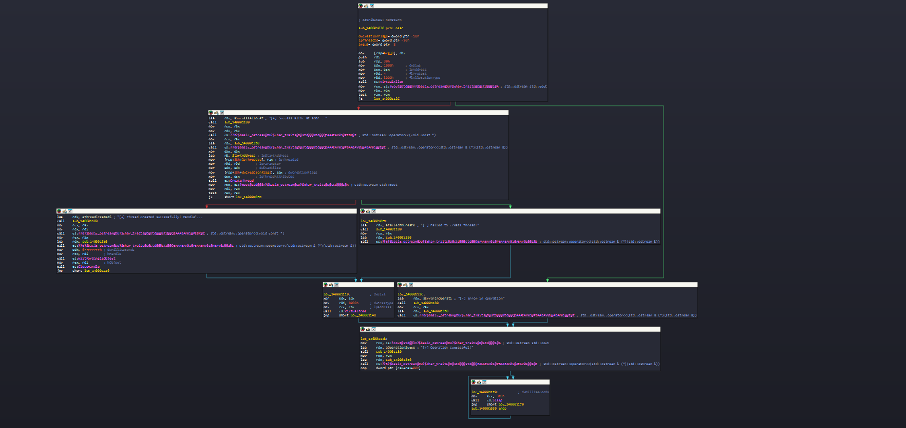
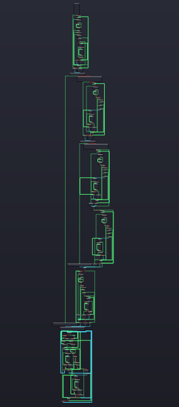
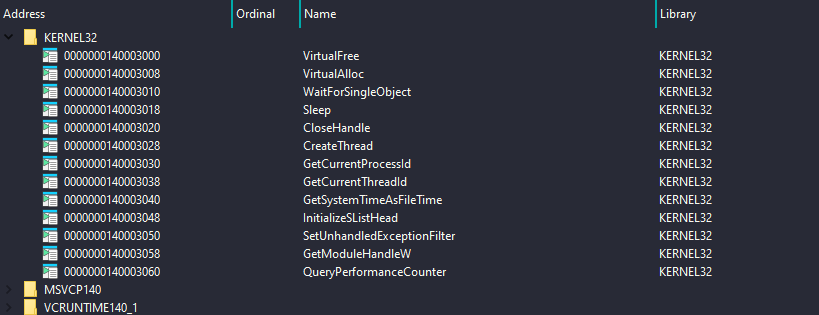
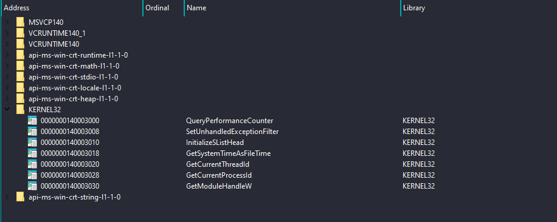

# Simple Lazy Importer (x64 Windows)

[]()
[]()
[]()
[]()
[]()

A high-performance, single-header C++ dynamic API resolver built exclusively for modern x64 Windows environments. Inspired by the classic *lazy importer*, this project was built from scratch as a practical way to test low-level engineering limits and demonstrate deep technical understanding of operating system internals, executable evasion, and manual parsing mechanics.

## Small Example

```cpp
SIMPLE_LAZY(MessageBoxA)(nullptr, "Hello world", "lazy_import", MB_OK);
```

---

## Technical Motivation

This repository demonstrates practical systems programming techniques in a Windows x64 environment. The primary goal is to implement a complete runtime API resolution system from scratch, without relying on the standard Windows Import Address Table (IAT). The design focuses on understanding how binaries are structured and how function resolution works at runtime through manual mechanisms.

---

## Low-Level Concepts Implemented

The architecture of this single-header implementation is built around Windows internals and PE export resolution techniques. It focuses on direct PEB traversal and manual export table parsing to resolve API addresses at runtime without relying on the Import Address Table (IAT).

### 1. PEB-Based Module Enumeration (x64)

The resolver accesses the Process Environment Block (PEB) via __readgsqword(0x60) and walks through:
PEB -> PEB_LDR_DATA -> InMemoryOrderModuleList
This allows enumeration of all loaded modules in the current process without using standard loader APIs such as GetModuleHandle.
This technique is used to locate module base addresses required for export resolution.

### 2. Manual PE/COFF Architecture Traversal

The code bypasses the native Windows Loader mechanics by manually mapping out structural headers in memory. It verifies valid DOS headers via `IMAGE_DOS_SIGNATURE`, shifts down to target NT Header markers, intercepts the specific data entries within `DataDirectory[IMAGE_DIRECTORY_ENTRY_EXPORT]`, and independently orchestrates parallel loops across `AddressOfNames`, `AddressOfFunctions`, and `AddressOfNameOrdinals` arrays.

### 3. Compile-Time Metaprogramming & String Hashing
By deploying C++ `constexpr` logic, all target API names are reduced to precise numeric representations via the FNV-1a hashing algorithm during the compilation phase. As a result, the finalized binary file contains no raw plaintext ASCII strings of system functions, rendering automated tools like `strings` useless during initial file profiling.

### 4. Global Lookup Caching Layer
Frequent and repetitive listing iterations through the active loaded module records create glaring behavioral traits that look suspicious under dynamic behavioral rules. To optimize execution paths and hide lookup activities, the base references of successfully evaluated target libraries are saved inside a persistent static storage variable for immediate recall on subsequent invocations.

### 5. Native x64 Calling Convention Integrity
Handling variable argument inputs securely without runtime degradation requires robust type forwarding. The invocation framework utilizes variadic templates matched with `std::forward` to pass target parameters into the rigid hardware registers dictated by the standard Microsoft x64 calling convention (RCX, RDX, R8, R9, followed by supplementary stack storage) without triggering stack misalignment errors.

---

## Comparison

| Before | After |
|---|---|
|  |  |

| Exports Before | Exports After |
|---|---|
|  |  |

## Code (Visual-Studio 2026 Build x64 Release /O2 Optimization)
```cpp
SIMPLE_LAZY(VirtualAlloc)(nullptr, 0x1000, MEM_COMMIT | MEM_RESERVE, PAGE_READWRITE);
```

## Output (IDA9.2)
```cpp
  p_InMemoryOrderModuleList = &NtCurrentPeb()->Ldr->InMemoryOrderModuleList;
  Flink = p_InMemoryOrderModuleList->Flink;
  if ( p_InMemoryOrderModuleList->Flink == p_InMemoryOrderModuleList )
  {
LABEL_19:
    v16 = v116;
  }
  else
  {
    while ( 1 )
    {
      if ( Flink[5].Flink )
      {
        v2 = 0;
        v3 = LOWORD(Flink[4].Blink) >> 1;
        if ( v3 )
        {
          do
            ++v2;
          while ( v2 < v3 );
        }
        v4 = Flink[2].Flink;
        if ( v4 )
        {
          if ( LOWORD(v4->Flink) == 23117 )
          {
            Blink_high = SHIDWORD(v4[3].Blink);
            if ( *(_DWORD *)((char *)&v4->Flink + Blink_high) == 17744 )
            {
              v6 = *(__int64 *)((char *)&v4[8].Blink + Blink_high);
              v116 = v6;
              if ( HIDWORD(v6) )
              {
                v7 = (unsigned int)v6;
                v8 = 0;
                v9 = *(_DWORD *)((char *)&v4[1].Blink + (unsigned int)v6);
                v10 = (__int64)v4 + *(unsigned int *)((char *)&v4[2].Flink + (unsigned int)v6);
                if ( v9 )
                {
                  while ( 1 )
                  {
                    v11 = -2128831035;
                    v12 = (char *)v4 + *(unsigned int *)(v10 + 4 * v8);
                    if ( *v12 )
                    {
                      do
                      {
                        v13 = *v12++;
                        v14 = v13 + 32;
                        if ( (unsigned __int8)(v13 - 65) > 0x19u )
                          v14 = v13;
                        v11 = 16777619 * (v11 ^ v14);
                      }
                      while ( *v12 );
                      if ( v11 == 117496385 )
                        break;
                    }
                    v8 = (unsigned int)(v8 + 1);
                    if ( (unsigned int)v8 >= v9 )
                      goto LABEL_18;
                  }
                  v15 = (struct _LIST_ENTRY *)((char *)v4
                                             + *(unsigned int *)((char *)&v4->Flink
                                                               + 4
                                                               * *(unsigned __int16 *)((char *)&v4->Flink
                                                                                     + 2 * v8
                                                                                     + *(unsigned int *)((char *)&v4[2].Flink + v7 + 4))
                                                               + *(unsigned int *)((char *)&v4[1].Blink + v7 + 4)));
                  if ( v15 )
                    break;
                }
              }
            }
          }
        }
      }
LABEL_18:
      Flink = Flink->Flink;
      if ( Flink == p_InMemoryOrderModuleList )
        goto LABEL_19;
    }
    qword_140005120 = (__int64)Flink[2].Flink;
    v16 = ((__int64 (__fastcall *)(_QWORD, __int64, __int64, __int64))v15)(0, 4096, 12288, 4);
  }
  v117 = v16;
```
